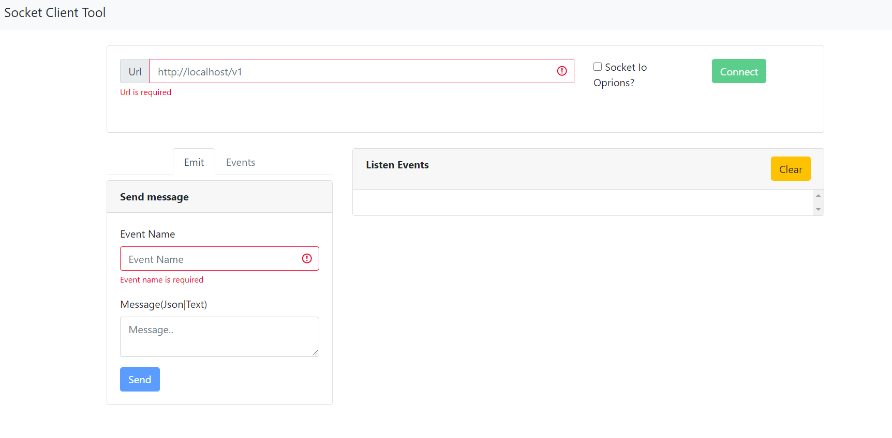
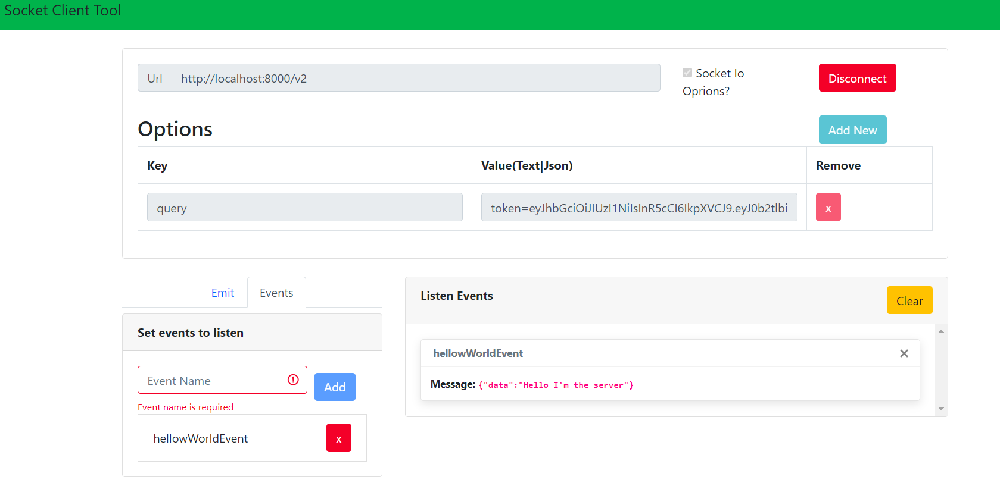

# Socket Test Client Tool
The tool was developen on Angular 10 version and it can helps you to test your socket io server.

# Preview
Disconnected             |  Connected
:-------------------------:|:-------------------------:
  |  

You can use this [Demo](https://alejandrotapiaq.github.io/socket-test-client/) but if you want to run it locally feel free to download the project.

This project was generated with [Angular CLI](https://github.com/angular/angular-cli) version 8.3.4.

## Development server

Run `ng serve` for a dev server. Navigate to `http://localhost:4200/`. The app will automatically reload if you change any of the source files.

## Further help

To get more help on the Angular CLI use `ng help` or go check out the [Angular CLI README](https://github.com/angular/angular-cli/blob/master/README.md).
